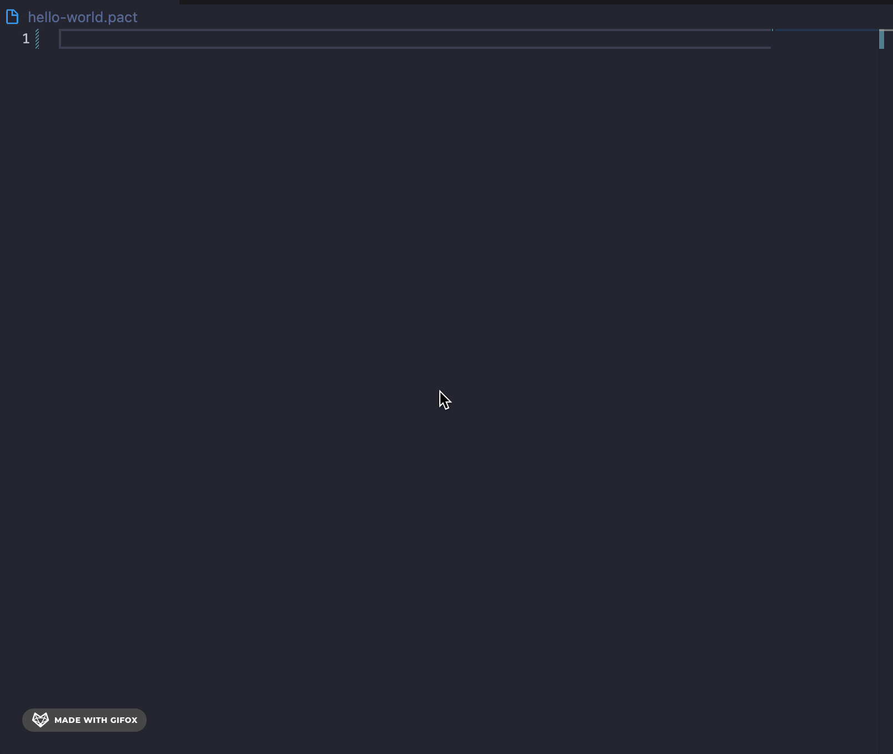

# Basic Pact Snippets

A collection of Pact snippets and commands. 


## Snippets

| Snippet | Renders                                       |
| ------- | --------------------------------------------- |
| `defun` | Create a function                                 |
| `module`| Create a module                      |
| `defschema`| Create a schema                      |
| `deftable`| Create a table                      |
| `pacthello`| Generate an example of hello                     |


## Full Expansions

### defun - Create a function

```
(defun | (|)
    @doc " | "
|)
```

### module - Create a module
```
(module | '|
  @doc " | "
|)
```

### defschema - Create a schema
```
 (defschema 
   @doc " "
 foo:bar)
```

### deftable - Create a table  
```
(deftable foo:{bar})
```

### pacthello - Generate an example of hello 
```
(namespace "free")
;;---------------------------------
;;
;;  Create an 'admin-keyset' and add some key, for loading this contract!
;;
;;  Make sure the message is signed with this added key as well.
;;
;;  When deploying new contracts, ensure to use a *unique keyset name*
;;  and *unique module name* from any previously deployed contract
;;
;;
;;---------------------------------
 
 
;; Keysets cannot be created in code, thus we read them in
;; from the load message data.
(define-keyset "free.admin-keyset" (read-keyset "admin-keyset"))
;; Define the module. The module name must be unique
(module hello-world GOV
  "A smart contract to greet the world."
 
;; Define module governance function
(defcap GOV ()
   (enforce-keyset "free.admin-keyset"))
(defun hello (name:string)
 "Do the hello-world dance"
 (format "Hello {}!" [name]))
)
 
;; and say hello!
(hello "world")
```